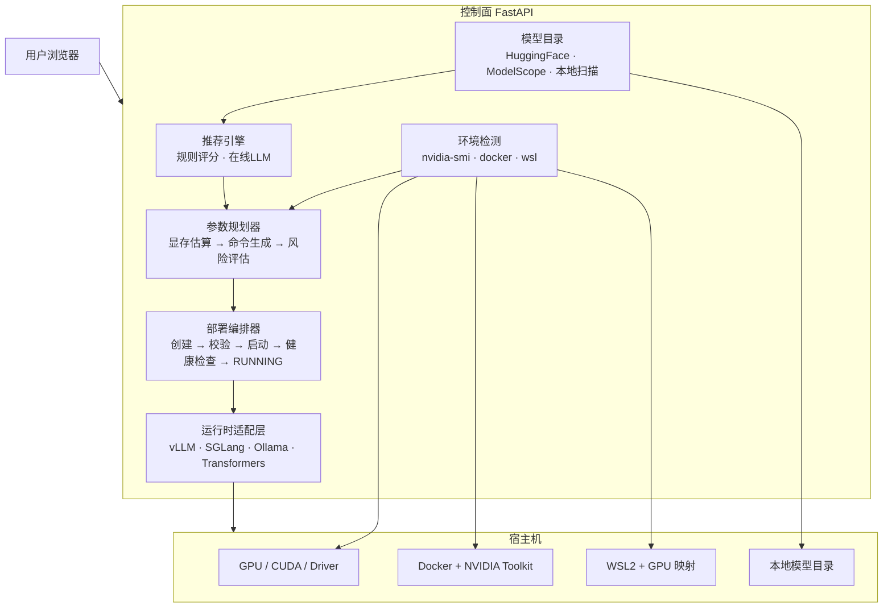

# 模型部署平台

> 轻量级 LLM 推理部署控制面：检测宿主机环境 → 推荐模型（含量化变体） → 下载缺失模型 → 选择 vLLM / SGLang / Ollama / Transformers → 预览启动参数 → 执行部署 → 健康检查 → OpenAI 兼容 API 测试。

平台本身不做推理、不加载权重。推理完全交给 vLLM / SGLang / Ollama / Transformers 子进程。

---

## 一、需求

| 编号 | 需求 | 状态 |
|------|------|------|
| R1 | 部署完成后自动检测宿主机环境 | ✅ PASS |
| R2 | 检测完成后推荐适合部署的模型（在线大模型决定 / 默认列表兜底，本地缺失时自动从 HuggingFace 或 ModelScope 下载） | ⚠️ PARTIAL |
| R3 | 完成后可选择使用 SGLang 还是 vLLM 部署 | ✅ PASS |
| R4 | 推荐部署参数预览，然后执行部署，输出测试页面和部署好的服务接口 | ⚠️ PARTIAL |
| R5 | 推荐合适的启动参数配置，支持调整 | ✅ PASS |
| R6 | 轻量级平台，平台本身不能太重 | ✅ PASS |

### 需求细化

**R1 — 环境检测**

- GPU 型号、显存总量 / 空闲、驱动版本
- CUDA Runtime、PyTorch CUDA 版本
- Docker + NVIDIA Container Toolkit
- WSL2 + GPU 映射
- vLLM / SGLang / Transformers / Ollama 安装状态
- CPU 核数、内存、磁盘剩余
- 操作系统、Python 版本

**R2 — 模型推荐**

- 规则引擎为主：任务匹配 × 显存约束 × 量化策略 × 后端兼容
- 在线大模型可插拔（未接入时自动降级为规则推荐）
- 默认模型目录含 BF16 / FP8 / AWQ / GPTQ 量化变体
- 本地缺失时标记 `download_required`，不伪装为 READY
- 下载来源：HuggingFace + ModelScope

**R3 — 后端选择**

- vLLM、SGLang、Ollama、Transformers 四种后端
- 自动检测已安装后端
- 按兼容性评分推荐

**R4 — 部署 + 测试**

- 参数预览 → 用户确认 → 执行部署
- 部署完成后输出：
  - 服务地址 `http://127.0.0.1:{port}/v1`
  - 健康检查地址
  - 测试页面
- OpenAI 兼容 API 测试

**R5 — 参数规划**

- 精度、上下文长度、并发数、显存利用率、量化方式
- 实时显存估算 + 风险等级（PASS / WARNING / BLOCKED）
- 用户可调整所有白名单参数
- 命令预览（只读，折叠在高级选项中）

**R6 — 轻量级**

- 控制面依赖：`fastapi` + `uvicorn` + `pydantic`
- 不把 `torch` / `transformers` / `vllm` / `sglang` 装入控制面环境
- 前端无构建依赖：单文件 HTML + 原生 CSS + 原生 JS
- SQLite 存储（第一版内存字典，可升级）

---

## 二、架构设计



### 部署模式

| 模式 | 适用场景 | 状态 |
|------|---------|------|
| 本地进程 | Linux / 已装推理环境 | ✅ Transformers 已验证 |
| Docker | Windows + WSL2 / 生产 | 📋 设计完成 |
| WSL2 | Windows + Linux 推理 | 📋 设计完成 |

### 量化策略

| 量化方式 | 后端兼容 | 显存 (8B 示例) | 推荐场景 |
|---------|---------|--------------|---------|
| BF16 | vLLM ✅ SGLang ✅ | ~18 GB | 质量优先 |
| FP8 | vLLM ✅ SGLang ✅ | ~12 GB | 吞吐优先 |
| AWQ INT4 | vLLM ✅ SGLang ✅ | ~9 GB | 低显存 |
| GPTQ INT4 | vLLM ✅ SGLang ✅ | ~9 GB | 低显存 |
| BitsAndBytes | Transformers only | N/A | 不推荐用于 vLLM/SGLang |

**关键规则**：vLLM / SGLang 不支持运行时 BitsAndBytes 量化，必须使用预量化 AWQ/GPTQ/FP8 checkpoint。平台会对此进行 BLOCKED 校验。

---

## 三、项目结构

```
model-deploy-platform/
├── backend/
│   ├── app/
│   │   ├── main.py                    # FastAPI 入口 + 路由 + 前端挂载
│   │   ├── services/
│   │   │   ├── environment.py         # 宿主机环境检测
│   │   │   ├── models.py              # 模型目录 + 规则推荐引擎
│   │   │   ├── planner.py             # 参数规划 + 显存估算 + 命令生成
│   │   │   └── deployments.py         # 部署生命周期管理
│   │   └── runtimes/
│   │       ├── ollama_runtime.py      # Ollama 适配（OpenAI 兼容 API）
│   │       ├── transformers_runtime.py # Transformers 适配
│   │       └── transformers_server.py  # OpenAI 兼容推理服务
│   ├── tests/
│   │   └── test_core.py               # 推荐逻辑 + 参数规划单测
│   └── requirements.txt              # fastapi, uvicorn, pydantic
├── frontend/
│   └── index.html                     # 单文件深色工作台 UI
├── catalog/
│   ├── models.yaml                    # 默认模型目录
│   └── compatibility.yaml             # 兼容规则
├── scripts/
│   └── smoke_test.py                 # API 冒烟测试
├── .env.example
├── .gitignore
└── README.md
```

---

## 四、API 参考

### 环境

| 方法 | 路径 | 说明 |
|------|------|------|
| GET | `/api/environment/latest` | 获取最新环境检测报告 |
| POST | `/api/environment/scan` | 触发重新扫描 |

### 模型

| 方法 | 路径 | 说明 |
|------|------|------|
| GET | `/api/models/catalog` | 默认模型目录（含量化变体） |
| GET | `/api/models/local` | 本地已下载模型扫描 |
| GET | `/api/models/ollama` | Ollama 已安装模型列表 |
| POST | `/api/models/recommend` | 规则推荐，请求体见下方 |

推荐请求：

```json
{
  "task": "chat",
  "goal": "balanced",
  "concurrency": 4,
  "available_vram_gb": 32,
  "backend": "vllm",
  "prefer_quantized": null,
  "require_local": false
}
```

### 参数规划

| 方法 | 路径 | 说明 |
|------|------|------|
| POST | `/api/plans/preview` | 参数预览 + 显存估算 + 命令生成 |

### 部署

| 方法 | 路径 | 说明 |
|------|------|------|
| GET | `/api/backends` | 检测可用后端 |
| POST | `/api/deployments` | 创建部署 |
| POST | `/api/deployments/{id}/start` | 启动部署 |
| POST | `/api/deployments/{id}/stop` | 停止部署 |
| GET | `/api/deployments` | 列出所有部署 |
| GET | `/api/deployments/{id}` | 获取部署详情 |

### 健康检查

| 方法 | 路径 | 说明 |
|------|------|------|
| GET | `/api/health` | 平台自身健康检查 |

---

## 五、快速开始

### 启动后端

```bash
cd backend
python -m pip install -r requirements.txt
python -m uvicorn app.main:app --host 127.0.0.1 --port 8790
```

### 打开界面

浏览器访问 `http://127.0.0.1:8790/`

### 运行测试

```bash
cd backend
python -m pytest -q
```

### 冒烟测试

先启动后端，然后：

```bash
python scripts/smoke_test.py
```

---

## 六、默认模型目录

| 模型 ID | 基座 | 精度 | 量化 | 显存 | 后端 |
|---------|------|------|------|------|------|
| qwen25-05b-instruct | Qwen2.5-0.5B | BF16 | — | 1.2 GB | vLLM, SGLang, Transformers |
| qwen3-1.7b-bf16 | Qwen3-1.7B | BF16 | — | 4.5 GB | vLLM, SGLang |
| qwen3-4b-bf16 | Qwen3-4B | BF16 | — | 10 GB | vLLM, SGLang |
| qwen3-8b-bf16 | Qwen3-8B | BF16 | — | 18 GB | vLLM, SGLang |
| qwen3-8b-fp8 | Qwen3-8B | FP8 | FP8 | 12 GB | vLLM, SGLang |
| qwen3-8b-awq | Qwen3-8B | INT4 | AWQ | 9 GB | vLLM, SGLang |
| qwen3-8b-gptq | Qwen3-8B | INT4 | GPTQ | 9 GB | vLLM, SGLang |
| qwen25-coder-7b-awq | Qwen2.5-Coder-7B | INT4 | AWQ | 8.5 GB | vLLM, SGLang |
| qwen25-14b-awq | Qwen2.5-14B | INT4 | AWQ | 15.5 GB | vLLM, SGLang |
| qwen25-32b-awq | Qwen2.5-32B | INT4 | AWQ | 22 GB | vLLM, SGLang |
| deepseek-r1-distill-qwen-7b | DeepSeek-R1-Distill-Qwen-7B | BF16 | — | 16 GB | vLLM, SGLang |
| llama-3.1-8b-bf16 | Llama-3.1-8B | BF16 | — | 18 GB | vLLM, SGLang |
| mistral-7b-awq | Mistral-7B-v0.3 | INT4 | AWQ | 8.5 GB | vLLM, SGLang |
| gemma-3-4b-bf16 | Gemma-3-4B | BF16 | — | 10 GB | vLLM, SGLang |
| phi-4-mini-bf16 | Phi-4-mini | BF16 | — | 9.5 GB | vLLM, SGLang |

### 推荐评分规则

```
基础分 = 任务匹配 × 40

goal=quality:      + 参数量 × 5 + BF16 加成 18
goal=balanced:     + 4-14B 甜点区加成 24 + BF16 加成 20 + 参数量 × 2
goal=low-memory:   + AWQ/GPTQ 加成 24 / FP8 加成 8 + 参数量 × 5
goal=throughput:   + FP8 加成 28 / AWQ/GPTQ 加成 18 + 并发加成

本地就绪:           + 30
显存硬约束:          超过安全预算(85%) → 排除，不降分
```

---

## 七、执行方案

### Phase 0 — 架构冻结 ✅

- API 契约
- 数据模型
- 默认模型目录
- 量化策略
- 兼容规则

### Phase 1 — 垂直切片 ✅

已打通的链路：

```
真实环境扫描 (nvidia-smi)
  → 本地模型扫描 (config.json + safetensors)
  → 规则推荐 (含量化变体)
  → 参数预览 (显存估算 + 命令数组)
  → 前端展示
```

### Phase 2 — Transformers 后端 ✅

```
创建部署 → subprocess 启动 transformers_server
  → 模型加载 → /health 成功
  → /v1/models 成功
  → /v1/chat/completions 成功
  → 前端测试页展示回复
```

### Phase 3 — Ollama 后端 ✅

```
检测 Ollama → 列出已安装模型
  → 创建部署 → 预加载模型
  → /v1/chat/completions (OpenAI 兼容)
  → 停止 → 卸载模型
```

### Phase 4 — 模型下载器 📋

```
模型不存在 → HuggingFace / ModelScope 下载
  → 校验完整性 → 登记本地模型
  → 进入部署流程
```

当前状态：API 预留，未实现真实下载。下载受 `HF_HUB_OFFLINE` 环境变量阻塞。

### Phase 5 — vLLM / SGLang 📋

```
真实 vLLM subprocess → /health → /v1/chat/completions
真实 SGLang subprocess → /health → /v1/chat/completions
```

当前状态：命令生成已实现，真实 subprocess 启动待实现。当前主机未安装 vLLM / SGLang。

### Phase 6 — Docker / WSL2 📋

```
同一套 Plan → Docker 容器执行 / WSL2 内执行
```

---

## 八、验收标准

| 验收项 | 状态 | 说明 |
|--------|------|------|
| 平台启动 | ✅ PASS | `uvicorn` 正常启动，监听 8790 |
| 浏览器访问 | ✅ PASS | 首页渲染，导航可用 |
| 真实 GPU 检测 | ✅ PASS | RTX 5090 / 32GB / Driver 581.29 |
| 本地模型扫描 | ✅ PASS | config.json + safetensors 识别 |
| 模型目录 | ✅ PASS | 含 BF16/FP8/AWQ/GPTQ 变体 |
| 规则推荐 | ✅ PASS | 量化模型在低显存/吞吐场景排名优先 |
| 参数预览 | ✅ PASS | 显存估算 + 命令数组 + 风险等级 |
| BitsAndBytes 拦截 | ✅ PASS | vLLM/SGLang 下返回 BLOCKED |
| Ollama 真实部署 | ✅ PASS | /v1/chat/completions 返回模型回复 |
| Transformers 真实部署 | ✅ PASS | subprocess 启动 + /health + /v1/chat |
| vLLM 真实部署 | 🚫 BLOCKED | 主机未安装 vLLM |
| SGLang 真实部署 | 🚫 BLOCKED | 主机未安装 SGLang |
| 模型下载 | 🚫 BLOCKED | HF_HUB_OFFLINE 限制 |
| 单元测试 | ✅ PASS | 4 passed |
| 冒烟测试 | ✅ PASS | SMOKE PASS |

### 不允许冒充完成的项

以下不能作为"真实部署完成"的依据：

- 前端构建成功
- Python 语法正确
- 单元测试通过
- 假进程启动成功
- 固定 Demo 页面
- 命令字符串生成成功

---

## 九、技术栈

| 层 | 技术 | 说明 |
|----|------|------|
| 后端 | FastAPI + Uvicorn + Pydantic | 控制面，不装 torch/CUDA |
| 前端 | 原生 HTML + CSS + JS | 单文件，无构建依赖 |
| 存储 | 内存字典 → SQLite | 第一版足够 |
| 推理 | vLLM / SGLang / Ollama / Transformers | 子进程，平台不加载权重 |
| 检测 | nvidia-smi + shutil.which + importlib | 无额外依赖 |

---

## 十、环境变量

| 变量 | 默认 | 说明 |
|------|------|------|
| `HF_HUB_OFFLINE` | unset | 设为 `1` 时 HuggingFace 下载被禁用 |
| `HF_ENDPOINT` | hf-mirror.com | HuggingFace 镜像 |
| `MODEL_ROOTS` | G:/models;/models | 本地模型扫描根目录 |

---

## 十一、后续演进

| 版本 | 目标 |
|------|------|
| v0.3 | 模型下载器（HF + ModelScope） |
| v0.4 | vLLM subprocess 真实部署 |
| v0.5 | SGLang subprocess 真实部署 |
| v0.6 | Docker / WSL2 模式 |
| v0.7 | SSE 实时部署日志 |
| v0.8 | 性能测试（TTFT / 吞吐 / P95） |
| v1.0 | 多 GPU + 远程节点 |
| v2.0 | Kubernetes + 多模型路由 |
