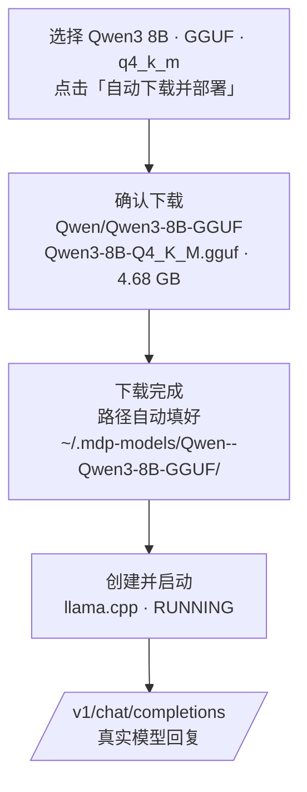
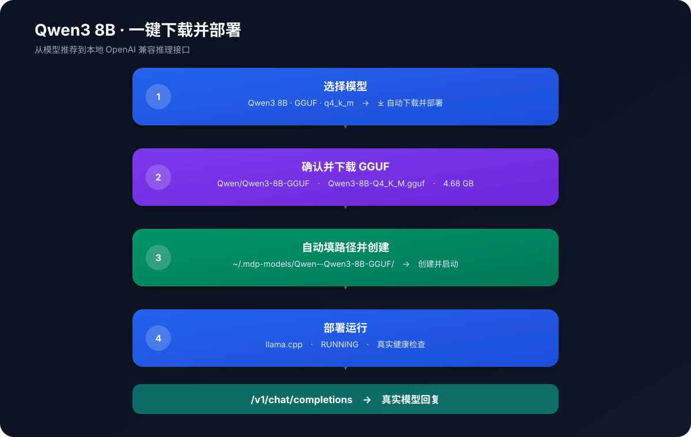
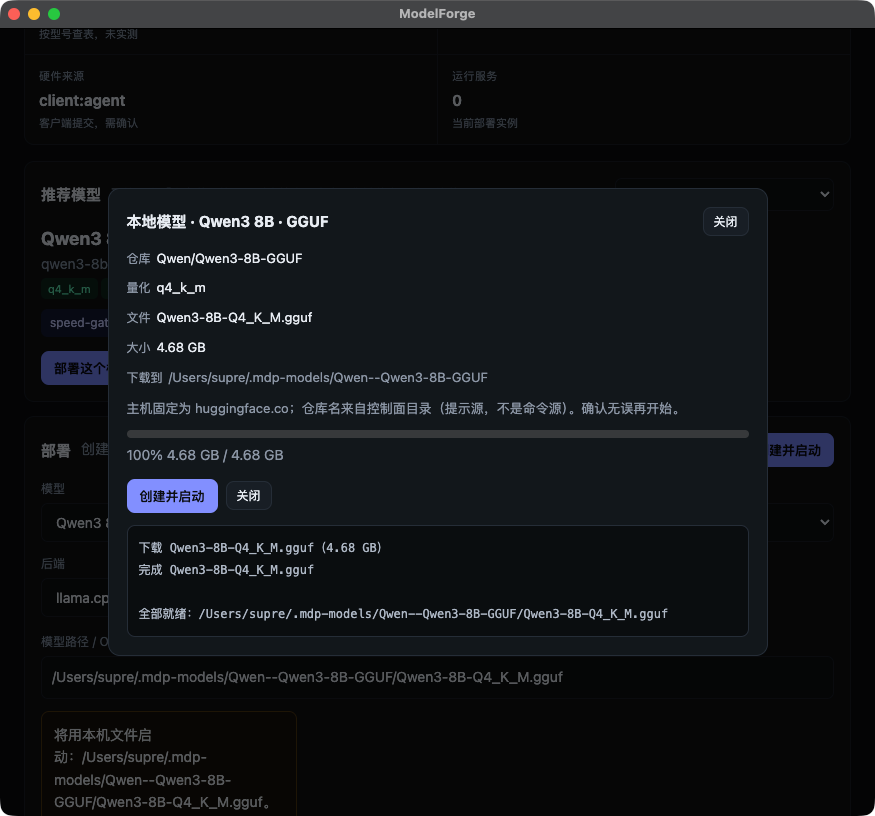
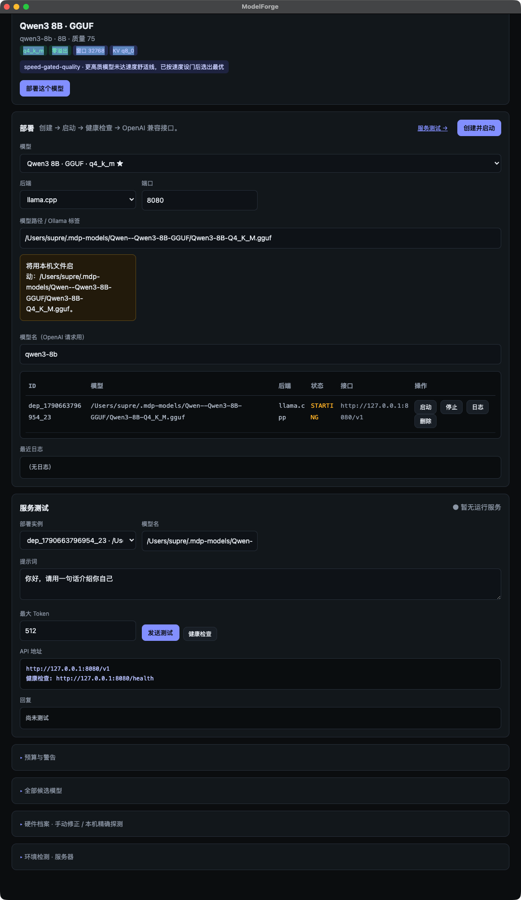
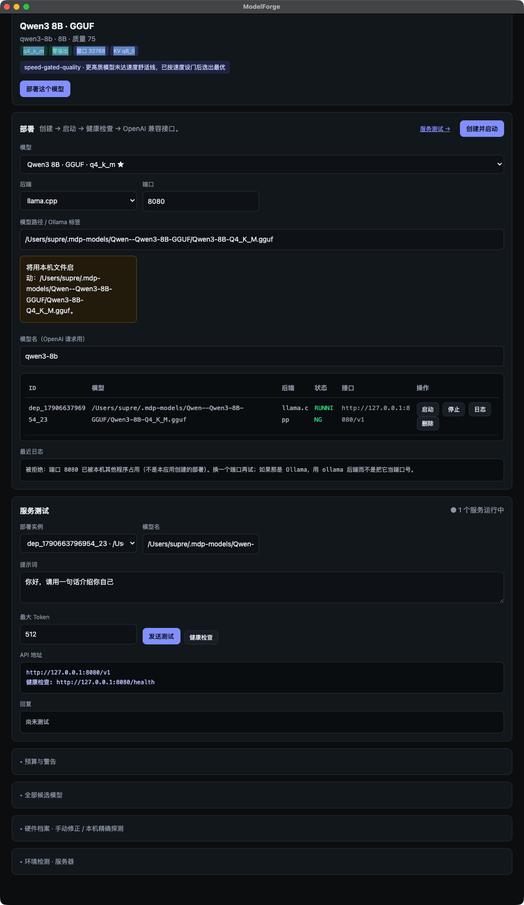
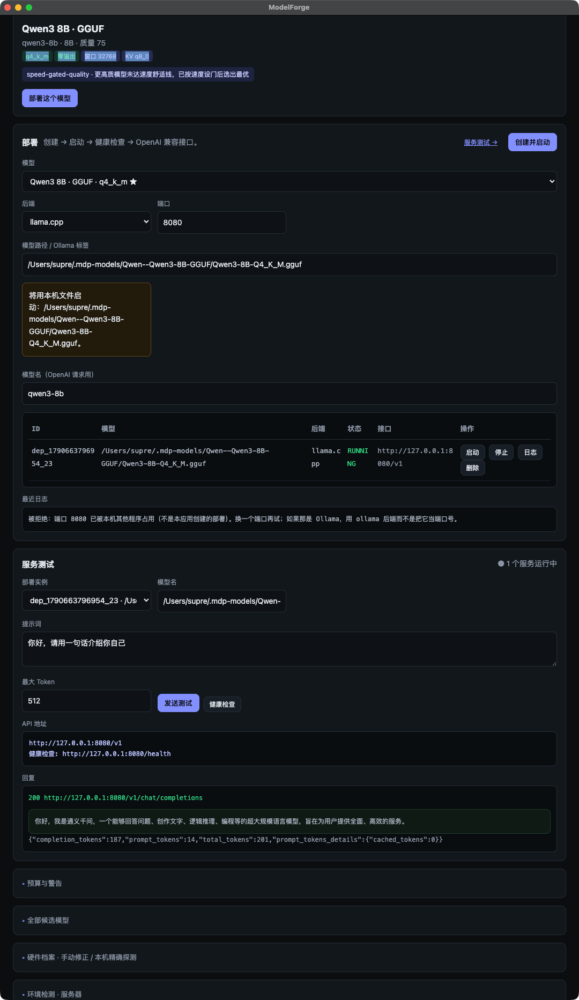
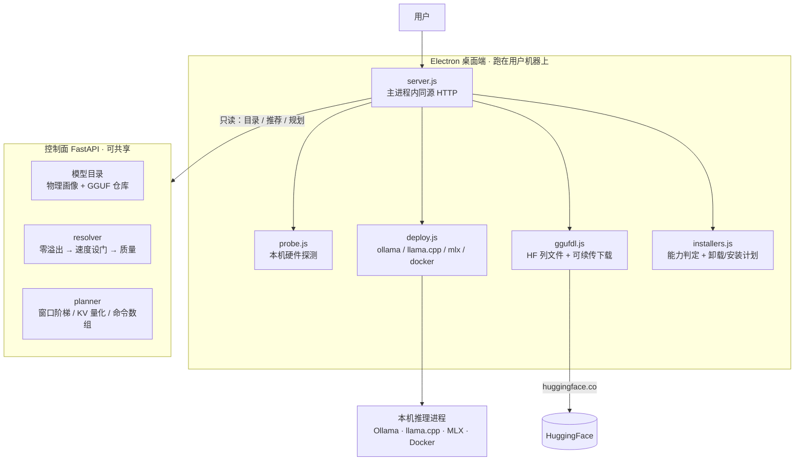

# 模型部署平台

**在一台什么都没装的机器上，从「打开应用」到「本地模型跑起来并能对话」，中间不需要 npm、不需要 pip、不需要记任何命令行。**

下载一个 4.68 GB 的模型，本来是这样：去 HuggingFace 找仓库 → 在几十个文件里挑对量化 → 认出 `-00001-of-00002` 那种分片 → 下载 → 把绝对路径填进启动参数。
这个项目把它变成点一下按钮。


```mermaid
flowchart TD
    A[选择 Qwen3 8B · GGUF · q4_k_m<br/>点击「自动下载并部署」]
    B[确认下载<br/>Qwen/Qwen3-8B-GGUF<br/>Qwen3-8B-Q4_K_M.gguf · 4.68 GB]
    C[下载完成<br/>路径自动填好<br/>~/.mdp-models/Qwen--Qwen3-8B-GGUF/]
    D[创建并启动<br/>llama.cpp · RUNNING]
    E[/v1/chat/completions<br/>真实模型回复/]
    A --> B --> C --> D --> E
```









上面这段不是设想。文件 **5,027,783,488 字节**、落盘魔数 `GGUF`、部署 `RUNNING`、真实推理返回上面那句 —— 都在 macOS（Apple M5 / 24 GB）上实测过。

---

## 目录

- [一、它是什么](#一它是什么)
- [二、现在就有的能力](#二现在就有的能力)
- [三、架构](#三架构)
- [四、一键下载：难在哪](#四一键下载难在哪)
- [五、安全模型：控制面是提示源，不是命令源](#五安全模型控制面是提示源不是命令源)
- [六、项目结构](#六项目结构)
- [七、快速开始](#七快速开始)
- [八、测试](#八测试)
- [九、API 参考](#九api-参考)
- [十、模型目录与推荐决策](#十模型目录与推荐决策)
- [十一、已验证 / 未验证](#十一已验证--未验证)
- [十二、TODO](#十二todo)
- [十三、技术栈与环境变量](#十三技术栈与环境变量)
- [十四、文档索引](#十四文档索引)

---

## 一、它是什么

两部分，职责完全分开：

| | 控制面（`backend/`） | 桌面端（`desktop/`） |
|---|---|---|
| 是什么 | FastAPI 服务，无鉴权，可局域网访问 | Electron 应用，跑在用户自己的机器上 |
| 管什么 | 环境档案、模型目录、推荐决策、参数规划 | 本机硬件探测、装后端、下模型、起进程 |
| 信不信 | **不信**。它的输出一律当作提示 | 所有命令在本地拼、所有路径在本地校验 |

平台本身**不做推理、不加载权重**。推理交给 Ollama / llama.cpp / MLX / Transformers / Docker 子进程，平台只负责「该跑哪个、参数是什么、起没起来、能不能答」。

前三者是 Apple Silicon 的一等公民；vLLM / SGLang 是 CUDA 路径，官方不发 macOS wheel，平台会如实说「这台机器装不了」而不是给一个必然失败的按钮。

---

## 二、现在就有的能力

### 硬件探测（macOS / Windows / Linux）

- Apple Silicon：`sysctl hw.memsize` 拿统一内存，按 **UMA** 建模（不是独立 VRAM）
- Windows：注册表 `HardwareInformation.qwMemorySize` 读显存（`Win32_VideoController.AdapterRAM` 是 uint32，>4 GB 会截断，所以不用它）
- NVIDIA：`nvidia-smi`，PATH 不在时回退到 `%SystemRoot%\\System32` 与 `NVSMI` 目录
- 集显 / 独显判定：按机型名归类（`Radeon 780M` 是集显、`Radeon R7 240` 不是）
- Docker 能力探测（**只探测，不代替用户装**）

### 推荐：不是显卡对照表，是纯函数 resolver

输入实测硬件预算 + 每个模型的物理画像，输出「该推荐谁 + 为什么」，每条都带 `reason_key`。

三条硬规矩：

1. **只有完全驻留（zero-spill）才自动推荐。** 会溢出的模型照样渲染那一行并解释原因，但必须用户显式选择。
2. **唯一硬拒绝是物理。** weights + 64K 上下文 + 运行时开销超过显存+内存才拒绝；补救是「换更小的量化」，不是「砍上下文」。**64K 是承诺，144K 是目标。**
3. **速度只用于排序和设门，不作为展示值。** 速度是纯内存带宽模型 `tok/s ≈ 带宽 / (体积 × decode_fraction)`，MoE 的 `decode_fraction` 刻画「每 token 只读活跃专家」。

这条规矩在统一内存上真的会改变结论：24 GB 的 M5 上，dense 14B 预测约 13.7 tok/s，低于 20 的舒适线，所以推荐落在 Qwen3-8B q4_k_m 或稀疏 30B-A3B 上，而不是「更大的那个」。

### 一键安装缺失的后端

点「本机未安装」→ 弹框说清**能不能装、走哪条路、装完是什么样** → 确认后执行。Linux/mac 走包管理器，Windows 走 winget。装不了的后端直接说装不了的原因。

### 一键下载模型并部署

见下一节。

### 部署 + 真实健康检查 + 真实推理测试

`/health` 是真的去连那个端口，不是读状态位；`/test` 是真的发一次 `/v1/chat/completions` 并把回复显示出来。

---

## 三、架构


```mermaid
flowchart TB
    User[用户]

    subgraph Desktop[Electron 桌面端 · 跑在用户机器上]
        Probe[probe.js<br/>本机硬件探测]
        LocalAPI[server.js<br/>主进程内同源 HTTP]
        Deploy[deploy.js<br/>ollama / llama.cpp / mlx / docker]
        GGUF[ggufdl.js<br/>HF 列文件 + 可续传下载]
        Install[installers.js<br/>能力判定 + 卸载/安装计划]
    end

    subgraph CP[控制面 FastAPI · 可共享]
        Catalog[模型目录<br/>物理画像 + GGUF 仓库]
        Resolver[resolver<br/>零溢出 → 速度设门 → 质量]
        Planner[planner<br/>窗口阶梯 / KV 量化 / 命令数组]
    end

    Host[本机推理进程<br/>Ollama · llama.cpp · MLX · Docker]

    User --> LocalAPI
    LocalAPI --> Probe
    LocalAPI --> Deploy
    LocalAPI --> GGUF
    LocalAPI --> Install
    LocalAPI -->|只读：目录 / 推荐 / 规划| CP
    Deploy --> Host
    GGUF -->|huggingface.co| HF[(HuggingFace)]
```

桌面端把本机硬件档案作为**请求参数**发给控制面。共享服务下控制面探测到的是*服务器*硬件，不是用户的机器 —— 所以 resolver 只吃一个 `HardwareBudget`，谁来提供都一样。

---

## 四、一键下载：难在哪

「下载一个 GGUF」听起来是个 HTTP GET。实际有四个坑，每个都真实踩到过：

### 坑 1：HuggingFace 对不存在的仓库也返回 401

```
Qwen/this-repo-does-not-exist-xyz123     -> 401
Qwen/Qwen2.5-VL-7B-Instruct-GGUF         -> 401   （需要授权，不是不存在）
Qwen/Qwen3-8B-GGUF                       -> 200
```

**401 不能当作「仓库存在」的证据。** 所以目录里 22 个 GGUF 仓库全部按 HTTP 200 逐个核实；11 个门控模型（llama / gemma / phi / mistral / deepseek）指向公开的第三方 GGUF 仓库并重新核实。剩下 2 个 CUDA-only 条目没有 GGUF，如实留空 —— 界面会说「这个模型没有配置 GGUF 仓库」，而不是给个按不动的按钮。

### 坑 2：文件名没有统一格式

实测采集到的真实文件名，现在就是测试夹具：

```
qwen2.5-0.5b-instruct-q4_k_m.gguf               小写
Llama-3.2-1B-Instruct-Q4_K_M.gguf               大写
Mistral-Nemo-Instruct-2407.Q4_K_M.gguf          点分隔
qwen2.5-7b-instruct-q4_k_m-00001-of-00002.gguf  分片
qwen2.5-coder-7b-instruct-q4_k_m.gguf           同一个仓库里
qwen2.5-coder-7b-instruct-q4_k_m-00001-of-00002.gguf   既有单文件又有分片版
mmproj-model-f16-4B.gguf                        多模态工程文件，不是模型
```

三条规则：

1. **量化必须是完整 token。** `q4_k_m` 不能命中 `IQ4_K_M`（那是另一种量化）；匹配处前后都不能是字母数字。
2. **有单文件就用单文件**，哪怕仓库同时提供分片版。
3. **分片要凑齐。** 缺片时返回空让上层报错，不猜；`-m` 只给第一片，llama.cpp 自己会找其余的。

`mmproj` 单独请求也拿不到 —— 把它当模型加载会以一种很难懂的方式失败。

### 坑 3：下载会断

先写 `.part`，中断后带 `Range` 接着下。服务器忽略 Range 而回了 200 时，**丢掉半截文件重新来**，而不是把整个新响应接到旧内容后面（那样会得到一个大小对、内容烂的文件）。

### 坑 4：路径不是字符串，是磁盘写入

`GET /api/models/gguf/download` 会**写磁盘** —— 而 GET 正是 `` 能触发的那一类。所以它和 `plan` 一样要本地 token，主机写死 `huggingface.co`，仓库 id 必须 `owner/name` 形状，文件名必须是单个 `.gguf` 基名（斜杠和 `..` 在表达层面就不可能）。

而且：**下载不在点按钮时开始。** 先把仓库 / 文件 / 大小 / 目标目录摆出来，用户确认后才动。

---

## 五、安全模型：控制面是提示源，不是命令源

这是整个设计里最不显眼、也最要紧的一条。

**前提：控制面不可信。** 它可能被换掉、被中间人改写、或者本来就是别人搭的。但它会告诉桌面端「这个模型该用哪条命令启动」—— 如果照搬，一个恶意控制面就能让用户在**自己机器上**执行任意命令。

所以：

| 规则 | 做法 |
|---|---|
| 命令不接受 | 所有 argv 在本地拼，控制面只提供值（模型 id、量化、窗口），且每个值都过形状校验与白名单 |
| 页面不接受 | CSP `default-src 'none'`，**每次响应一个随机 nonce**；模板里 nonce 占位符数量不对就直接 500 而不是发出一个弱策略 |
| 本机服务不接受任意网页 | 本地 HTTP 校验 `Host` 必须是回环、`Origin` 若存在必须匹配，写操作还要一个**每进程随机 token**（页面里以内联方式注入） |
| 模型路径不接受 | llama.cpp 的 `model_path` 必须是**本机存在的绝对路径**；填 HuggingFace 仓库 id 会在创建时就报错并点名原因，而不是起一个必然失败的进程 |
| 端口不接受 | 创建时探测端口是否已被别的程序占用，占了就 400 说清楚，而不是起冲突 |

信任边界有 40 条独立测试；CSP 的**真实边界**也实测过（挡得住外部脚本，挡不住内联注入 —— 所以内联事件处理器已全部清除，改成 `data-act` + 单个 `document` 监听器）。

---

## 六、项目结构

```
model-deploy-platform/
├── backend/                          # 控制面：不装 torch / CUDA
│   ├── app/
│   │   ├── main.py                   # 路由 + 前端挂载（CSP nonce / API token 注入）
│   │   ├── local_http.py             # 本机探测专用：trust_env=False（否则走系统代理）
│   │   ├── services/
│   │   │   ├── catalog.py            # 24 个模型的物理画像 + GGUF 仓库
│   │   │   ├── estimator.py          # footprint / physics_check / 带宽速度模型
│   │   │   ├── hardware.py           # HardwareBudget（含 UMA）
│   │   │   ├── profiles.py           # 客户端档案解析 / 钳制 / 档案码
│   │   │   ├── gpu_table.py          # GPU 型号 → 显存 / UMA 查表
│   │   │   ├── planner.py            # 窗口阶梯 / KV 量化 / 命令数组
│   │   │   ├── models.py             # 推荐 API 外壳 + 本地 checkpoint 登记
│   │   │   └── deployments.py        # 部署生命周期
│   │   └── runtimes/                 # Ollama / Transformers 适配
│   └── tests/                        # 18 个测试文件，203 条
├── desktop/                          # Electron 桌面端
│   ├── main.js                       # 单实例锁、窗口安全基线
│   ├── server.js                     # 主进程内同源 HTTP（无 CORS、无 PNA 预检）
│   ├── probe.js                      # macOS / Windows / Linux 硬件探测
│   ├── deploy.js                     # ollama / llama.cpp / mlx / docker 执行 + 本地校验
│   ├── gguf.js                       # 挑文件：量化匹配 / 分片 / 排除 mmproj（纯函数）
│   ├── ggufdl.js                     # HF 列文件 + 可续传流式下载
│   ├── installers.js                 # 后端能力判定 + 安装计划
│   ├── smoke.js                      # 端到端冒烟（含可选真实推理）
│   └── test-*.js                     # 9 个测试文件
├── frontend/index.html               # 单文件深色工作台（无构建步骤）
└── docs/                             # 设计 + QA 报告
```

---

## 七、快速开始

### 桌面端（推荐）

```bash
cd desktop
npm install
npm start
```

窗口自己会在主进程里起一个同源 HTTP 服务（随机端口），不需要另外开控制面。首次启动会探测本机硬件、列出可用的后端与推荐模型。

打包：

```bash
npm run dist:mac     # dmg
```

### 控制面（可单独跑，可共享）

```bash
cd backend
python -m venv .venv && .venv/bin/pip install -r requirements.txt
.venv/bin/uvicorn app.main:app --host 0.0.0.0 --port 8790
```

打开 `http://127.0.0.1:8790`。

### 局域网访问

监听 `0.0.0.0`，同网段可直接打开，API 与前端同源。部署接口返回的 `endpoint` 按**调用方请求的 Host** 生成，所以局域网客户端看到的是 `http://<本机IP>:<port>/v1`。

> ⚠️ 控制面**无鉴权**，能创建/启动/停止进程。只在可信网络暴露。
> 非本机请求创建部署默认 403（模型会落到服务器而不是用户机器），单租户可信机器可设 `MDP_ALLOW_REMOTE_DEPLOY=1`。

---

## 八、测试

**711 条检查**，其中相当一部分是「真去连、真去下、真去推理」而不是打桩。

```bash
cd backend && .venv/bin/python -m pytest -q      # 203
cd desktop && npm test                           # 303（7 个 node 套件）
cd desktop && npm run test:all                   # 448（+ 3 个 Electron 套件）
```

| 套件 | 条数 | 说明 |
|---|---:|---|
| `backend/tests/`（18 个文件） | 203 | 推荐决策表（像 golden file 一样 pin 住）、规划器、部署契约、信任边界、Windows 探测、CSP nonce |
| `desktop/smoke.js` | 24 | 端到端：起服务 → 探测 → 建部署 → 健康检查 → 删除；`--ollama <模型>` 追加真实推理往返 |
| `desktop/test-gguf.js` | 31 | 挑 GGUF：量化整体匹配、分片凑齐、单文件优先、排除 mmproj |
| `desktop/test-trust.js` | 40 | 恶意控制面给的命令不被执行；所有 argv 都是本地拼的 |
| `desktop/test-install.js` | 59 | 后端可装性判定（按平台 / 架构 / 包管理器） |
| `desktop/test-docker.js` | 89 | Docker 后端契约、镜像探测、端口冲突 |
| `desktop/test-server.js` | 104 | 本机 HTTP 层：token、来源校验、请求体上限、代理；含**真连 HuggingFace** 的下载规划 |
| `desktop/test-mlx.js` | 16 | MLX 启动参数随 mlx-lm 版本演进 |
| `desktop/test-frontend.js` | 124 | 页面：事件委托、CSP 下无内联处理器、下载流程、提示文案 |
| `desktop/test-backend-ui.js` | 15 | 后端下拉只列真能跑的 |
| `desktop/test-layout.js` | 6 | 窗口自适应（不是固定宽度） |

### 变异测试

关键规则都用「拆掉它，看测试是否真的会红」验证过 —— 只看测试通过数是不够的。DESK-32 的 7 条变异全部被抓：

```
分片不再让位于单文件   -> 3 条失败
量化不再要求整体匹配   -> 1 条失败
不再排除 mmproj        -> 1 条失败
不再校验仓库 id 形状   -> 4 条失败
提示里不再挂按钮       -> 4 条失败
不再区分是不是桌面端   -> 1 条失败
plan 端点不再要 token  -> 1 条失败
```

变异过程本身也挖出过真 bug：分片分组循环把解析结果直接当非空用，不变式是隐式的，一旦破坏就是**崩溃**而不是失败 —— 已改成跳过解析不出来的项。

---

## 九、API 参考

### 环境

| 方法 | 路径 | 说明 |
|---|---|---|
| GET | `/api/environment/latest` | 最新环境检测报告 |
| POST | `/api/environment/scan` | 触发重新扫描 |

### 模型

| 方法 | 路径 | 说明 |
|---|---|---|
| GET | `/api/models/catalog` | 模型目录（物理画像 + GGUF 仓库） |
| GET | `/api/models/local` | 本地已下载模型扫描 |
| GET | `/api/models/ollama` | Ollama 已安装模型 |
| POST | `/api/models/recommend` | 推荐（请求体见下） |

```json
{
  "task": "chat", "goal": "balanced", "concurrency": 4,
  "available_vram_gb": null, "backend": "ollama",
  "require_local": false, "limit": 20, "live": false,
  "hardware": {
    "source": "browser", "platform": "darwin", "architecture": "arm64",
    "cpu_cores": 10, "ram_gb": 24,
    "gpus": [{"name": "Apple M4 Pro", "vendor": "apple", "vram_gb": null, "uma": true}]
  }
}
```

响应关键字段：

```json
{
  "mode": "resolver",
  "hardware": {"usable_vram_gb": 19.2, "total_device_gb": 24.0, "uma": true, "source": "sysctl"},
  "recommendation": {"id": "qwen3-8b", "quantization": "q4_k_m", "zero_spill": true,
                     "reason_key": "speed-gated-quality"},
  "reason": "更高质模型未达速度舒适线，已按速度设门后选出最优",
  "recommendations": [
    {"id": "qwen3-8b", "recommended": true, "zero_spill": true, "fits": true,
     "reason_key": "zero-spill-resident"},
    {"id": "qwen3-14b", "recommended": false, "zero_spill": true, "fits": true,
     "reason_key": "zero-spill-resident"}
  ],
  "total_candidates": 24
}
```

每一行都带 `reason_key`；溢出的行 `zero_spill=false` 但仍然可见，`fits=false` 的行带 `refusal` 说明物理原因。

### 客户端硬件（共享服务）

服务端探测到的是服务器硬件。所以硬件档案作为**请求参数**传入，resolver 只吃一个 `HardwareBudget`。

| 方法 | 路径 | 说明 |
|---|---|---|
| GET | `/api/hardware/self` | 服务器自身档案（标注 source=server） |
| GET | `/api/hardware/gpus` | GPU 型号 → 显存 / UMA 查表（浏览器读不到显存） |
| POST | `/api/hardware/resolve` | 校验并钳制客户端档案 |
| POST | `/api/hardware/parse` | 解析档案码或粘贴的 JSON |
| POST | `/api/hardware/profile-code` | 把档案编码成可粘贴的档案码 |
| GET | `/api/hardware/probe.py` | 本机精确探测脚本（只读，打印 JSON） |
| GET | `/api/hardware/probe.ps1` | Windows 版探测脚本（不依赖 Python） |
| GET | `/api/hardware/probe-command` | 按请求 base URL 生成一行探测命令 |

**浏览器探测的边界**：`deviceMemory` 只有粗档位且封顶 8 GB，Safari / Firefox 不支持。所以显存由 **GPU 型号查表**得到并标记不可信；Apple Silicon 的统一内存需要**用户确认档位**；精确检测靠本机执行探测脚本后粘回 JSON 或档案码。详见 `docs/client-hardware-detection.md`。

### 桌面端本地端点（主进程内，需 token）

| 方法 | 路径 | 说明 |
|---|---|---|
| GET | `/api/health` | `mode=desktop` |
| GET | `/api/hardware/self` | 本机真实档案 |
| GET | `/api/backends` | 本机可用后端 |
| GET | `/api/models/gguf/plan` | 查仓库文件、报真实大小与目标路径 |
| GET | `/api/models/gguf/download` | **SSE** 流式下载（可续传） |
| POST | `/api/deployments` | 创建（含路径 / 端口本地校验） |
| POST | `/api/deployments/{id}/start` | `/stop` | 启动 / 停止 |
| GET | `/api/deployments/{id}/health` | **真实**健康检查（连端口，不读状态位） |
| POST | `/api/deployments/{id}/test` | **真实** `/v1/chat/completions` |

### 完整部署流程

```
选推荐模型
  → POST /api/deployments              创建（本地校验路径绝对且存在、端口未被占）
  → POST /api/deployments/{id}/start    启动
  → GET  /api/deployments/{id}/health   真实健康检查
  → POST /api/deployments/{id}/test     真实 chat completion
  → POST /api/deployments/{id}/stop     停止
```

---

## 十、模型目录与推荐决策

24 个条目。**22 个带核实过的 GGUF 仓库**，全部能一键下载；剩下 2 个是 CUDA-only（vLLM / SGLang 专用），如实标注没有 GGUF。

| 基座 | 参数 | 原生上下文 | 后端 | 量化 |
|---|---:|---:|---|---|
| Qwen2.5 0.5B | 0.5 B | 32K | llama.cpp, mlx, ollama, transformers | q4_k_m, q8_0, mlx-4bit |
| Llama 3.2 1B | 1 B | 128K | llama.cpp, mlx, ollama, transformers | q4_k_m, q8_0, mlx-4bit |
| Qwen2.5 1.5B | 1.5 B | 32K | llama.cpp, mlx, ollama, transformers | q4_k_m, q8_0, mlx-4bit |
| Llama 3.2 3B | 3 B | 128K | llama.cpp, mlx, ollama, transformers | q4_k_m, q8_0, mlx-4bit |
| Qwen2.5 3B | 3 B | 32K | llama.cpp, mlx, ollama, transformers | q4_k_m, q8_0, mlx-4bit |
| Gemma 3 4B | 4 B | 128K | 全部六种 | 全部 |
| Phi-4-mini | 3.8 B | 128K | 全部六种 | 全部 |
| Mistral 7B | 7 B | 32K | 全部六种 | 全部 |
| Qwen2.5 7B | 7 B | 32K | 全部六种 | 全部 |
| Qwen2.5-Coder 7B | 7 B | 32K | 全部六种 | 全部 |
| Qwen3 8B | 8 B | 32K | 全部六种 | 全部 |
| DeepSeek-R1 7B | 7 B | 32K | 全部六种 | 全部 |
| InternLM3 8B | 8 B | 32K | 全部六种 | 全部 |
| Llama 3.1 8B | 8 B | 128K | 全部六种 | 全部 |
| Qwen2.5-VL 7B | 7 B | 32K | 全部六种 | 全部 |
| Mistral Nemo 12B | 12 B | 128K | 全部六种 | 全部 |
| Qwen2.5 14B | 14 B | 32K | 全部六种 | 全部 |
| Qwen3 14B | 14 B | 32K | 全部六种 | 全部 |
| **Qwen3 30B-A3B（MoE）** | 30 B | **256K** | 全部六种 | 全部 |
| Qwen2.5 32B | 32 B | 32K | 全部六种 | 全部 |
| Qwen3 32B | 32 B | 32K | 全部六种 | 全部 |
| DeepSeek-R1 32B | 32 B | 32K | 全部六种 | 全部 |
| Qwen2.5-VL 7B · AWQ/GPTQ | 8 B | 32K | sglang, vllm | awq, gptq, fp8, bf16 |
| Phi-4-mini · AWQ/GPTQ | 3.8 B | 128K | sglang, vllm | awq, gptq, fp8, bf16 |

### resolver 的分支

```
候选 = physics_check 通过？
  否 → 不参与自动推荐，仅可见 + 可解释（physics-refused）
  是 → zero_spill？（weights + 64K KV + 运行时开销全进设备内存）
        否 → 不参与自动推荐，仅可显式选择（spill-visible）
        是 → predicted_decode_tok_s >= 20？
              是 → 合格池里取 max(quality, -size)
                    存在 quality 更高但被速度淘汰的 → speed-gated-quality
                    否则                          → best-quality-resident
              否 → 驻留中最快的 → fastest-resident
```

`reason_key` 枚举：`best-quality-resident` / `speed-gated-quality` / `fastest-resident` / `no-recommendation`，逐行还有 `zero-spill-resident` / `spill-visible` / `physics-refused` / `backend-incompatible`。**前端只渲染 resolver 真正命中的那个分支，不重新推导。**

### 决策表（`tests/test_recommendation.py` 像 golden file 一样 pin 住）

| 预算 | 离散卡（vllm/sglang） | 统一内存 UMA（ollama/llama.cpp） |
|---:|---|---|
| 16 GB | 更小的量化能驻留就推荐，否则无推荐 | 小模型驻留；8B q8_0 低于舒适线 → 降精度到 q4_k_m |
| 24 GB | 30B-A3B AWQ 驻留且快 | Qwen3-8B q4_k_m · speed-gated-quality |
| 32–128 GB | 稀疏 MoE 胜出 | 稀疏 MoE 胜出（dense 14B/32B 在 210 GB/s 下低于舒适线） |
| 512 GB | dense 32B 仍被速度设门，MoE 胜出 | 同上 |

这张表就是 resolver 存在的理由：**统一内存 24–128 GB 这一列**。dense 14B 在 210 GB/s 下预测约 13.7 tok/s，低于 20 的舒适线，所以稀疏 30B-A3B 或更小的 q4_k_m 胜出。

---

## 十一、已验证 / 未验证

这一节按「证据来自哪里」分开写，不混在一起。

### macOS（Apple M5 / 24 GB / arm64）本机实测

| 项目 | 证据 |
|---|---|
| 硬件探测 | `sysctl` 统一内存；`Apple M5 / arm64 / 10 cores / 24 GB / uma:true` |
| **一键下载 GGUF** | `Qwen/Qwen3-8B-GGUF` → `Qwen3-8B-Q4_K_M.gguf`，**5,027,783,488 字节**，落盘魔数 `GGUF`，目标 `~/.mdp-models/Qwen--Qwen3-8B-GGUF/` |
| **llama.cpp 真实部署** | 上一步的模型 → `RUNNING` on 8080 → `/health` 200 → `/v1/chat/completions` 返回真实文本 |
| Ollama 真实部署 | `qwen3.5:9b` → RUNNING → health 200 → chat 200 |
| MLX 真实部署 | `mlx-lm 0.31.3`（Metal 可用）+ 4-bit 权重，真实补全 |
| Docker 真实推理 | 真 llama.cpp 容器 + 4.7 GB GGUF → 补全 200（CPU，无 GPU） |
| thinking 模型空回复 | 截断时回退到 `reasoning` 并给出提示，不再是空白 |
| 端口冲突 | 8080 已被真实部署占用时，创建请求返回 400 并说清原因 |

### 未验证 / 不可能 —— 不要当成已完成

| 项目 | 状态 |
|---|---|
| **在 Windows 真机上跑过** | ✅ 已跑（Windows 10 19045 / i7-10700K / 32 GB / RTX 3060 12 GB）。逐条证据见 `docs/windows-verification.md`；基础支持 17 条中 16 条 ✅（W8 的 PowerShell 7 一半无法验证），GPU 额外 6 条中 5 条 ✅，**只剩 vLLM / SGLang 真实推理**（镜像 8.41 GB，拉取中） |
| **vLLM / SGLang 原生（macOS）** | 🚫 不可能，官方不发 macOS wheel |
| Docker **GPU 直通** | ✅ Windows 已验证（WSL2 后端，`--gpus all` + 应用自身部署链路）；🚫 macOS 上无法验证（容器是 Linux 虚拟机且拿不到 GPU） |

#### 其他未验证项

| # | 项目 | 现状 |
|---|---|---|
| T1 | Docker 容器生命周期**与真实推理** | ✅ CPU 与 GPU 两条路径都在 Windows 真机上跑通（应用自身后端驱动，非手写 `docker run`）；**仅 vLLM / SGLang 的官方镜像未起过**（多 GB 级，拉取中） |
| T2 | macOS 打包公证（notarization） | 未做。`electron-builder --dir --mac` 能构建，代码签名自动跳过 |
| T3 | Windows `nsis` 安装包 | ✅ 已在 Windows 真机构建 → 安装到含中文与空格的路径 → 启动 → 卸载，全部通过；**未做代码签名**（SmartScreen 会警告） |

---

## 十二、TODO

### Windows 真机验证结论（2026-09-29，详见 `docs/windows-verification.md`）

> 第一台 Windows 真机：Windows 10 19045 / i7-10700K / 32 GB / RTX 3060 12 GB /
> 驱动 536.23；无 winget、无 pwsh 7；非提权会话（按需 UAC 提权）。

| # | 项目 | 现状 | 真机结果 |
|---|---|---|---|
| W1 | 整条 `probeWindows()` 路径 | 仅静态审查 + 纯函数单测 | ✅ 与系统真值一致：CPU/内存 31.8 GB/RTX 3060 12 GB/vendor/uma 全对 |
| W2 | 注册表读显存 `HardwareInformation.qwMemorySize`（REG_QWORD） | 按已知事实实现 | ✅ 12 GB 未截断（同机 `AdapterRAM` 确实截断成 4 GB，证明该绕行是必需的） |
| W3 | `windowsGpuIsUma()` 集显判定 | 纯函数测了 30+ 个机型名 | ✅ 本机真实字符串（UHD 630/P630=UMA，RTX 3060=独显）判定正确；虚拟显示适配器归 unknown |
| W4 | `classifyGpuVendor()` | 同上 | ✅ nvidia/intel 归类正确 |
| W5 | `nvidia-smi` 不在 PATH 时的回退 | 已实现三条路径 | ✅ 加测「machine policy 禁读注册表」路径；**发现脚本在有虚拟适配器时仍以退出码 1 结束**，见下方 G1 |
| W6 | 多路 CPU（`Win32_Processor.Name` 返回多行） | 已去重并用 `Join(' + ')` 合并 | ⚪ 单路机器，未验证 |
| W7 | WSL2 检测（读 `/proc/version`） | 已实现 | ✅ 控制面的 WSL 检测已修（G3）：现在真跑 `wsl --status`；`lxss\tools` / `lxcore.sys` / LxssManager 均已落盘，`docker info` 报 `Kernel=6.18.40.1-microsoft-standard-WSL2` |
| W8 | `GET /api/hardware/probe.ps1` 端点 | 已实现 | 🟡 PowerShell 5.1 全绿（含 Restricted 策略下 `irm \| iex`）；**PowerShell 7 无法验证**（本机无 pwsh，也装不了） |
| W9 | `probe-command` 的平台分派 | 已按平台分派 | ❌ 非 win32 分支依赖 `python3`，本机没有 → 命令不可执行，见 G2 |
| W10 | electron-builder 的 **nsis 安装包** | 配置已写（x64） | ✅ 构建/安装/启动/卸载全通过；**首轮构建的包完全不可用**（漏文件，见 G0），已修 |
| W11 | Windows 上的 Docker GPU 路径 | 文档记录只在 WSL2 后端提供 | ✅ 已通：官方 CUDA 镜像 `--gpus all nvidia-smi` 看到 RTX 3060（driver 560.94 / CUDA 12.6）；应用自身的 docker 后端 create→RUNNING→推理→stop→delete 全通，含 `gpus=all` 与二次 start |


**真机复核时一并确认这几个历史坑**（代码里都已修，Windows 真机上已确认前两条的判定逻辑正确，其余机型本机没有样本）：

- `AMD Radeon(TM) Graphics` —— 厂商后缀 `(TM)` 曾导致匹配失败
- `AMD Radeon 780M` 家族 —— 曾被判成独显
- 老一代 APU：`Radeon HD 8650G` / `Radeon R7 Graphics` —— 曾被判成独显
- **不能误判**成集显的：`Radeon HD 7970`、`Radeon R7 240`、`Radeon R7 M260`、`Arc A770M`

### 已知缺口

- **GGUF 仓库名来自控制面。** 主机和形状都能校验，但**不能**校验「这个仓库里的这个文件真的是那个模型」—— 恶意控制面可以指向另一个 4 GB 的 gguf。目前的防线是下载前把仓库 / 文件 / 大小摆给用户看，由人判断。要真正解决需要控制面签名。
- **没有完整性校验。** 下载完不比对 sha256（HF API 里有 `lfs.oid` 可用）。
- **下载前不检查磁盘空间。** 20 GB 的模型可能下到一半才发现没地方放。
- **mlx / docker / ollama 的模型获取没有统一。** 只有 llama.cpp 有这条一键链路。
- **控制面无鉴权。**
- **macOS GUI 启动的 app 拿不到 Homebrew 的 PATH**（系统只给 `/usr/bin:/bin:/usr/sbin:/sbin`）。
- **Windows 上虚拟显示适配器会被当成一块没有显存的显卡。** `OrayIddDriver Device` / `GameViewer Virtual Display Adapter`（`Root\…IddDriver`）会进 GPU 列表、vendor=unknown。按最大显存挑设备时不影响结论，但它们会出现在设备列表和「未识别独立显卡」的告警里。见 `docs/windows-verification.md` G1。
- **Windows 上 `compareToJson` 之外的控制台输出仍是代码页（GBK）编码**，`deploy.js` 现在按 `chcp` 解码，但一次性读出的一大块输出里如果跨了多字节边界，仍可能出现半个字。

---

## 十三、技术栈与环境变量

| 层 | 技术 | 说明 |
|---|---|---|
| 控制面 | FastAPI + Uvicorn + Pydantic | 不装 torch / CUDA |
| 桌面端 | Electron（`contextIsolation` + `sandbox` + `execFile`） | 不用 shell，不给渲染进程 Node |
| 前端 | 原生 HTML + CSS + JS | 单文件，**无构建步骤** |
| 存储 | 内存字典 + JSON 文件 | 第一版足够 |
| 推理 | Ollama / llama.cpp / MLX / Transformers / Docker | 子进程，平台不加载权重 |
| 检测 | `sysctl` / 注册表 / `nvidia-smi` / `shutil.which` | 无额外依赖 |

| 变量 | 默认 | 说明 |
|---|---|---|
| `HF_HUB_OFFLINE` | unset | 设为 `1` 时 HuggingFace 下载被禁用 |
| `HF_ENDPOINT` | hf-mirror.com | HuggingFace 镜像 |
| `HF_TOKEN` / `HUGGING_FACE_HUB_TOKEN` | unset | 门控仓库下载用 |
| `MODEL_ROOTS` | G:/models;/models | 本地模型扫描根目录 |
| `MDP_GGUF_DIR` | `~/.mdp-models` | GGUF 下载落盘目录 |
| `MDP_PORT` | 随机 | **仅测试/调试**用；默认随机是为了让本机其他页面猜不到 |
| `MDP_ALLOW_REMOTE_DEPLOY` | unset | 设为 `1` 允许非本机请求创建部署 |

---

## 十四、文档索引

| 文档 | 内容 |
|---|---|
| `docs/trust-boundary.md` | 控制面 → 本地执行的信任边界完整设计 |
| `docs/client-hardware-detection.md` | 浏览器探测的边界与档案码方案 |
| `docs/docker-design.md` | Docker 后端契约 |
| `docs/probe-session-design.md` | 本机探测协议 |
| `docs/qa-findings.md` | QA 汇总（67 条，三个子代理独立报告） |
| `docs/qa-findings-backend.md` | 后端 24 条 |
| `docs/qa-findings-desktop.md` | 桌面端 28 条 |
| `docs/qa-findings-frontend.md` | 前端 15 条 + 后续 DESK-29 / 30 / 31 / 32 |
| `docs/qa-round3.md` | 独立验证轮 |
| `docs/windows-gaps.md` | Windows 缺口逐条（**静态审查阶段**的历史文档，结论已被真机验证取代） |
| `docs/windows-verification.md` | Windows 真机验证报告（证据 + 完成度核对表 + 本轮修复） |
| `docs/vllm-deployment-gaps.md` | vLLM 部署缺口 |
